  

  <a href="https://nacscripts.dev"><strong>Website ↗</strong></a>
  &nbsp; / &nbsp;
  <a href="https://github.com/cancevik0?tab=repositories"><strong>Projects ↗</strong></a>

### Hey, I'm Can — aka NAC.

I build stuff, break stuff, and occasionally fix stuff. My interests span **web development, game modding, and desktop & mobile apps**. This is where I share experiments, small tools, and things I learn along the way.

<table>
  <tr>
    <td width="33%" valign="top"><strong>01 / WEB</strong>  Interfaces, web apps, and tools built with JavaScript, React, and Node.js.</td>
    <td width="33%" valign="top"><strong>02 / GAMES</strong>  Lua scripting, FiveM, and gameplay systems with QBCore.</td>
    <td width="33%" valign="top"><strong>03 / EXPERIMENTS</strong>  Python utilities, C projects, and ideas worth turning into code.</td>
  </tr>
</table>

### Selected projects

<table>
  <tr>
    <td width="50%" valign="top">
      <h3><a href="https://github.com/cancevik0/Twitch-Chat-Bot">Twitch Chat Bot ↗</a></h3>
      Modular chat automation for Twitch streams.  
      <code>JavaScript</code> <code>Node.js</code> <code>tmi.js</code>
    </td>
    <td width="50%" valign="top">
      <h3><a href="https://github.com/cancevik0/Flickfeed">Flickfeed ↗</a></h3>
      A film showcase project for the web.  
      <code>JavaScript</code> <code>Web</code>
    </td>
  </tr>
  <tr>
    <td width="50%" valign="top">
      <h3><a href="https://github.com/cancevik0/Entropy">Entropy ↗</a></h3>
      A password generator project.  
      <code>Web</code> <code>CSS</code>
    </td>
    <td width="50%" valign="top">
      <h3><a href="https://github.com/cancevik0/py-speedtest">py-speedtest ↗</a></h3>
      Internet speed testing with live progress bars.  
      <code>Python</code> <code>CLI</code>
    </td>
  </tr>
</table>

### In the toolkit

| | Technologies |
| :--- | :--- |
| **Languages** | JavaScript · Python · Lua · C · C# · Kotlin |
| **Web & game development** | React · Node.js · Express.js · QBCore |
| **Data** | MySQL · SQLite · MongoDB |
| **Tools** | Git · Docker · Linux |

  
<strong>Earlier experiments</strong>

   

- [bank-app](https://github.com/cancevik0/bank-app) — a simple banking interface written in C.
- [C-Calculator](https://github.com/cancevik0/C-Calculator) — an educational calculator project in C.

---

  Always learning, always coding, and always caffeinated. 
  Respect for my brothers who support me. Viva Brothers, may the force be with us.

